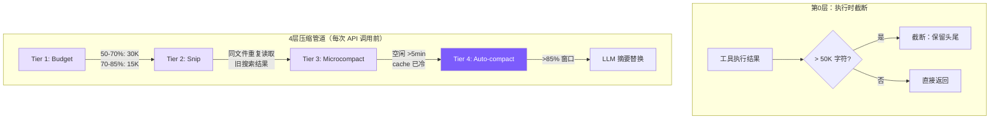

# 6. 上下文管理

## 本章目标

防止对话历史超出 LLM 的上下文窗口：4 层分级压缩管道，从轻量级截断到全量摘要逐级递进。



## Claude Code 怎么做的

Claude Code 在 `src/services/compact/` 中实现了一个 **4 级压缩流水线**：

1. **Tool Result Budgeting**：根据上下文使用率动态缩减工具结果
2. **Snip**：用占位符替换过时的工具结果（如同一文件的旧读取）
3. **Microcompact**：当 prompt cache 失效时激进清理旧结果
4. **Auto-compact**：达到 87% 时调用 LLM 生成摘要替换整个历史

核心设计：**前 3 层零 API 成本**——只操作本地消息数组。只有第 4 层需要额外 API 调用。

触发机制是 `AutoCompactTrackingState`，在每次 API 返回后检查 token 用量。

## 我们的实现

我们实现了与 Claude Code 对应的 4 层管道：执行时截断 + Budget + Snip + Microcompact + Auto-compact。

### 第 0 层：执行时截断（truncateResult）

在工具执行层面，防止单个工具结果撑爆上下文：

```typescript
// tools.ts — truncateResult

const MAX_RESULT_CHARS = 50000;

function truncateResult(result: string): string {
  if (result.length <= MAX_RESULT_CHARS) return result;
  const keepEach = Math.floor((MAX_RESULT_CHARS - 60) / 2);
  return (
    result.slice(0, keepEach) +
    "\n\n[... truncated " + (result.length - keepEach * 2) + " chars ...]\n\n" +
    result.slice(-keepEach)
  );
}
```

50K 字符大约对应 12K-15K tokens。为什么保留头尾？

- **头部**：文件开头通常有 imports、类定义等结构信息
- **尾部**：命令输出的错误摘要、测试结果通常在最后

### 第 1 层：Budget — 动态缩减工具结果

当上下文使用率升高时，历史中的工具结果需要更激进地截断：

```typescript
// agent.ts — budgetToolResultsAnthropic

private budgetToolResultsAnthropic(): void {
  const utilization = this.lastInputTokenCount / this.effectiveWindow;
  if (utilization < 0.5) return;  // 50% 以下不做处理

  // 动态预算：越接近上限越紧
  const budget = utilization > 0.7 ? 15000 : 30000;

  for (const msg of this.anthropicMessages) {
    if (msg.role !== "user" || !Array.isArray(msg.content)) continue;
    for (let i = 0; i < msg.content.length; i++) {
      const block = msg.content[i] as any;
      if (block.type === "tool_result" && typeof block.content === "string"
          && block.content.length > budget) {
        const keepEach = Math.floor((budget - 80) / 2);
        block.content = block.content.slice(0, keepEach) +
          `\n\n[... budgeted: ${block.content.length - keepEach * 2} chars truncated ...]\n\n` +
          block.content.slice(-keepEach);
      }
    }
  }
}
```

**关键区别**：执行时截断（第 0 层）是一次性的 50K 限制；Budget 是每次 API 调用前的动态重新截断，预算随上下文压力自动收紧。

### 第 2 层：Snip — 替换过时的工具结果

识别"过时"的工具结果，用占位符替换：

```typescript
// agent.ts — 常量
const SNIPPABLE_TOOLS = new Set(["read_file", "grep_search", "list_files", "run_shell"]);
const SNIP_PLACEHOLDER = "[Content snipped - re-read if needed]";
const KEEP_RECENT_RESULTS = 3;  // 永远保留最近 3 个结果
```

**Snip 策略**：
1. 同一文件被 `read_file` 多次 → snip 旧的（只保留最新读取）
2. 搜索结果超过 3 个 → snip 最旧的
3. **永远不 snip 最近 3 个 tool_result**（可能正在被引用）
4. 只清 `tool_result` 的 content，保留 `tool_use` block（模型仍能看到调用了什么工具 + 什么参数）

```typescript
// Snip 只在上下文 > 60% 时触发
const utilization = this.lastInputTokenCount / this.effectiveWindow;
if (utilization < SNIP_THRESHOLD) return;

// 找到 tool_result 对应的 tool_use，获取工具名和输入
const toolInfo = this.findToolUseById(toolUseId);
if (toolInfo && SNIPPABLE_TOOLS.has(toolInfo.name)) {
  // 标记为可 snip
}
```

这是 Claude Code 的核心设计之一：**保留工具调用的元数据**（调用了什么、参数是什么），但释放大量结果数据占用的 token。模型如果需要，可以重新读取文件。

### 第 3 层：Microcompact — Prompt Cache 冷启动时激进清理

```typescript
// agent.ts
const MICROCOMPACT_IDLE_MS = 5 * 60 * 1000;  // 5 分钟

private microcompactAnthropic(): void {
  if (!this.lastApiCallTime ||
      (Date.now() - this.lastApiCallTime) < MICROCOMPACT_IDLE_MS) return;
  // 清理：除最近 3 个外，所有旧 tool_result → "[Old result cleared]"
}
```

**为什么用时间触发？** Claude Code 的 prompt cache 有 TTL。如果距上次 API 调用超过 5 分钟，缓存大概率已过期。此时保留旧消息内容没有成本优势（反正要重新发送），不如激进清理释放空间。

### 第 4 层：Auto-compact — 全量摘要压缩

#### 触发条件

```typescript
// agent.ts — checkAndCompact

private async checkAndCompact(): Promise<void> {
  if (this.lastInputTokenCount > this.effectiveWindow * 0.85) {
    printInfo("Context window filling up, compacting conversation...");
    await this.compactConversation();
  }
}
```

- **`effectiveWindow`** = 模型上下文窗口 - 20000（预留给新的输入/输出）
- **85% 阈值**：当输入 token 超过有效窗口的 85% 时触发
- **`lastInputTokenCount`**：每次 API 返回后更新

```typescript
// 在构造函数中计算
this.effectiveWindow = getContextWindow(this.model) - 20000;

// 上下文窗口配置
const MODEL_CONTEXT: Record<string, number> = {
  "claude-sonnet-4-20250514": 200000,
  "claude-haiku-4-20250414": 200000,
  "claude-opus-4-20250514": 200000,
  "gpt-4o": 128000,
  "gpt-4o-mini": 128000,
};
```

#### Anthropic 后端压缩

```typescript
// agent.ts — compactAnthropic

private async compactAnthropic(): Promise<void> {
  if (this.anthropicMessages.length < 4) return;  // 太短不值得压缩

  // 保留最后一条用户消息
  const lastUserMsg = this.anthropicMessages[this.anthropicMessages.length - 1];

  // 用 LLM 生成摘要
  const summaryResp = await this.anthropicClient!.messages.create({
    model: this.model,
    max_tokens: 2048,
    system: "You are a conversation summarizer. Be concise but preserve important details.",
    messages: [
      ...this.anthropicMessages.slice(0, -1),  // 除最后一条外的所有历史
      {
        role: "user",
        content: "Summarize the conversation so far in a concise paragraph, "
               + "preserving key decisions, file paths, and context needed to continue the work.",
      },
    ],
  });

  const summaryText = summaryResp.content[0]?.type === "text"
    ? summaryResp.content[0].text
    : "No summary available.";

  // 用摘要替换整个历史
  this.anthropicMessages = [
    {
      role: "user",
      content: `[Previous conversation summary]\n${summaryText}`,
    },
    {
      role: "assistant",
      content: "Understood. I have the context from our previous conversation. "
             + "How can I continue helping?",
    },
  ];

  // 恢复最后一条用户消息
  if (lastUserMsg.role === "user") {
    this.anthropicMessages.push(lastUserMsg);
  }

  this.lastInputTokenCount = 0;  // 重置计数
}
```

压缩后的消息数组从可能的几十条变成 2-3 条，大幅释放上下文空间。

#### OpenAI 后端压缩

逻辑相同，但要保留 system 消息（OpenAI 把 system prompt 放在消息数组中）：

```typescript
// agent.ts — compactOpenAI

private async compactOpenAI(): Promise<void> {
  if (this.openaiMessages.length < 5) return;

  const systemMsg = this.openaiMessages[0];  // 保留 system 消息
  const lastUserMsg = this.openaiMessages[this.openaiMessages.length - 1];

  const summaryResp = await this.openaiClient!.chat.completions.create({
    model: this.model,
    max_tokens: 2048,
    messages: [
      {
        role: "system",
        content: "You are a conversation summarizer. Be concise but preserve important details.",
      },
      ...this.openaiMessages.slice(1, -1),
      {
        role: "user",
        content: "Summarize the conversation so far...",
      },
    ],
  });

  const summaryText = summaryResp.choices[0]?.message?.content || "No summary available.";

  // 重建：system + summary + 最后的用户消息
  this.openaiMessages = [
    systemMsg,
    { role: "user", content: `[Previous conversation summary]\n${summaryText}` },
    { role: "assistant", content: "Understood. I have the context..." },
  ];

  if ((lastUserMsg as any).role === "user") {
    this.openaiMessages.push(lastUserMsg);
  }

  this.lastInputTokenCount = 0;
}
```

### 手动压缩

用户也可以通过 REPL 命令手动触发：

```
> /compact
  ℹ Conversation compacted.
```

调用链：`cli.ts` → `agent.compact()` → `compactConversation()` → `compactAnthropic()` / `compactOpenAI()`

### Token 统计

每次 API 调用后更新统计：

```typescript
// Anthropic
this.totalInputTokens += response.usage.input_tokens;
this.totalOutputTokens += response.usage.output_tokens;
this.lastInputTokenCount = response.usage.input_tokens;

// OpenAI
if (response.usage) {
  this.totalInputTokens += response.usage.prompt_tokens;
  this.totalOutputTokens += response.usage.completion_tokens;
  this.lastInputTokenCount = response.usage.prompt_tokens;
}
```

`lastInputTokenCount` 只记录最近一次的输入 token（用于判断是否接近窗口上限），而 `totalInputTokens` 累计所有调用（用于费用估算）。

### 管道编排：runCompressionPipeline

4 层在每次 API 调用前顺序执行：

```typescript
// agent.ts — 在 chatAnthropic / chatOpenAI 中
while (true) {
  // 在 API 调用前运行压缩管道（Tier 1-3 是零 API 成本）
  this.runCompressionPipeline();

  const response = await this.callAnthropicStream();
  this.lastApiCallTime = Date.now();  // 为 microcompact 记录时间
  // ...

  // 在工具执行后检查是否需要 Tier 4
  await this.checkAndCompact();
}
```

```typescript
private runCompressionPipeline(): void {
  this.budgetToolResultsAnthropic();   // Tier 1: 动态预算
  this.snipStaleResultsAnthropic();    // Tier 2: 过时替换
  this.microcompactAnthropic();         // Tier 3: 激进清理
}
```

**关键设计决策**：Tier 1-3 **就地修改** message 数组（Claude Code 把溢出存磁盘，对教学实现太复杂）。模型需要时可以重新 `read_file`。

## 简化对比

| 维度 | Claude Code | mini-claude |
|------|------------|-------------|
| **压缩层级** | 4 级流水线 | 4 层（budget + snip + microcompact + 摘要） |
| **Token 计数** | 精确计数每条消息 | 使用 API 返回的 input_tokens |
| **Budget 触发** | 基于剩余预算 | 50%/70% 双阈值 |
| **Snip 策略** | 选择性裁剪 + cache 感知 | 同文件去重 + 保留最近 3 个 |
| **Microcompact** | 时间 + 缓存状态 | 5 分钟空闲触发 |
| **Auto-compact** | AutoCompactTrackingState | 85% 阈值 |
| **保留内容** | 工具调用摘要、关键决策 | tool_use block 保留 + 单段摘要 |
| **溢出存储** | 磁盘持久化 | 就地修改（不可恢复） |
| **代码量** | ~1000 行（compact 目录） | ~200 行 |

---

> **下一章**：底层引擎已经完成。最后我们来把它包装成一个好用的 CLI 工具——参数解析、REPL 交互、会话持久化。
