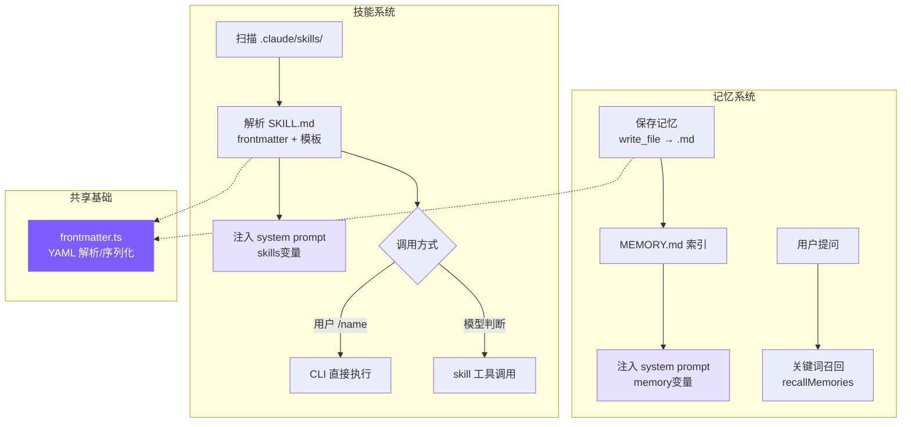
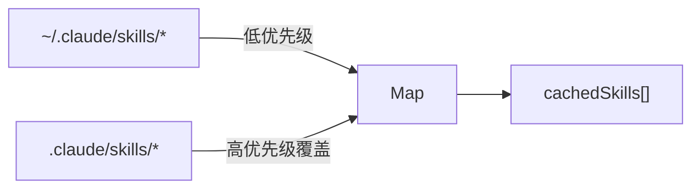
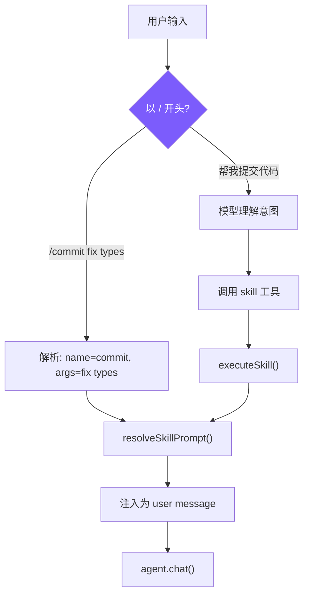

# 8. 记忆系统与技能系统

## 本章目标

实现两个跨会话能力：记忆系统让 Agent 在多次对话间保持对用户和项目的认知；技能系统让重复性 AI 工作流模板化，像 Shell 脚本一样即装即用。两者共享同一套 Frontmatter 元数据格式，并通过 system prompt 注入让模型知道如何使用它们。



---

## 记忆系统

### Claude Code 怎么做的

Claude Code 的记忆系统（`src/memdir/`）解决一个根本问题：**没有记忆的 Agent，每次对话都是初见**。你第一天告诉它"不要在回复末尾总结"，第二天还得再说一遍。

核心设计：

1. **封闭四类型分类法**：`user`（用户角色/偏好）、`feedback`（行为纠正）、`project`（项目进展/决策）、`reference`（外部资源指针）。封闭分类强制模型做明确的语义判断，比自由标签更可控
2. **MEMORY.md 索引文件**：列出所有记忆的摘要，每次会话预加载到 system prompt。限制 200 行 / 25KB 以控制 token 消耗
3. **语义召回**：通过 `sideQuery`（用 Sonnet 做轻量级查询）按需加载相关记忆的完整内容
4. **只记忆不可推导的信息**：代码模式、架构、git 历史这些能从项目本身读取，不应保存为记忆——否则一次重构就让记忆变成误导

### 我们的实现

#### 存储结构

```
~/.mini-claude/projects/{sha256-hash}/memory/
├── MEMORY.md                          # 索引文件
├── user_prefers_concise_output.md     # 用户偏好
├── feedback_no_summary_at_end.md      # 行为纠正
├── project_auth_migration_q2.md       # 项目进展
└── reference_ci_dashboard_url.md      # 外部链接
```

路径中的 `sha256-hash` 是 `process.cwd()` 的哈希前 16 位——同一个项目目录始终映射到同一个记忆空间，不同项目的记忆彼此隔离。

#### 记忆文件格式

每个记忆是一个带 YAML frontmatter 的 Markdown 文件：

```markdown
---
name: 不要在回复末尾总结
description: 用户明确要求省略总结段落
type: feedback
---
用户说"不要在响应末尾总结"，因为他们能自己看 diff 和代码变更。

**Why:** 用户觉得总结浪费时间，更喜欢直接给出结果。
**How to apply:** 完成任务后直接结束，不要加 "总结" 或 "以上是..." 段落。
```

#### Frontmatter 解析（共享模块）

记忆和技能都需要解析 YAML frontmatter，所以抽出了 `frontmatter.ts`：

```typescript
// frontmatter.ts — 解析 `---` 分隔的 YAML 头

export function parseFrontmatter(content: string): FrontmatterResult {
  const lines = content.split("\n");
  if (lines[0]?.trim() !== "---") return { meta: {}, body: content };

  let endIdx = -1;
  for (let i = 1; i < lines.length; i++) {
    if (lines[i].trim() === "---") { endIdx = i; break; }
  }
  if (endIdx === -1) return { meta: {}, body: content };

  const meta: Record<string, string> = {};
  for (let i = 1; i < endIdx; i++) {
    const colonIdx = lines[i].indexOf(":");
    if (colonIdx === -1) continue;
    const key = lines[i].slice(0, colonIdx).trim();
    const value = lines[i].slice(colonIdx + 1).trim();
    if (key) meta[key] = value;
  }

  const body = lines.slice(endIdx + 1).join("\n").trim();
  return { meta, body };
}
```

为什么不用 `js-yaml` 之类的库？因为我们的 frontmatter 只是简单的 `key: value`，不涉及嵌套、数组、多行字符串等复杂 YAML 特性。20 行手写解析器够用且零依赖。

#### 保存与索引

```typescript
// memory.ts — saveMemory

export function saveMemory(entry: Omit<MemoryEntry, "filename">): string {
  const dir = getMemoryDir();
  const filename = `${entry.type}_${slugify(entry.name)}.md`;
  const content = formatFrontmatter(
    { name: entry.name, description: entry.description, type: entry.type },
    entry.content
  );
  writeFileSync(join(dir, filename), content);
  updateMemoryIndex();  // 每次写入后重建索引
  return filename;
}
```

文件名格式 `{type}_{slugified_name}.md` 有两个好处：一眼看出类型，且文件系统排序时自然按类型分组。

索引重建很直接——遍历所有 `.md` 文件（排除 `MEMORY.md` 自身），生成一行一条的列表：

```typescript
// memory.ts — updateMemoryIndex

function updateMemoryIndex(): void {
  const memories = listMemories();
  const lines = ["# Memory Index", ""];
  for (const m of memories) {
    lines.push(`- **[${m.name}](${m.filename})** (${m.type}) — ${m.description}`);
  }
  writeFileSync(getIndexPath(), lines.join("\n"));
}
```

#### 索引截断

Claude Code 对 MEMORY.md 设了两个硬限制：200 行和 25KB。我们照搬：

```typescript
// memory.ts — loadMemoryIndex

const MAX_INDEX_LINES = 200;
const MAX_INDEX_BYTES = 25000;

export function loadMemoryIndex(): string {
  // ...
  const lines = content.split("\n");
  if (lines.length > MAX_INDEX_LINES) {
    content = lines.slice(0, MAX_INDEX_LINES).join("\n") +
      "\n\n[... truncated, too many memory entries ...]";
  }
  if (Buffer.byteLength(content) > MAX_INDEX_BYTES) {
    content = content.slice(0, MAX_INDEX_BYTES) +
      "\n\n[... truncated, index too large ...]";
  }
  return content;
}
```

为什么要截断？因为索引会被完整注入到每轮对话的 system prompt 中。200 条记忆 × 每条约 1 行 ≈ 几百 tokens，可控。如果不限制，记忆越积越多，system prompt 会慢慢吞噬上下文窗口。

#### 召回：关键词匹配 vs 语义搜索

这是我们和 Claude Code **最大的简化点**：

```typescript
// memory.ts — recallMemories

export function recallMemories(query: string, limit = 5): MemoryEntry[] {
  const memories = listMemories();
  if (memories.length === 0) return [];

  // 分词：只保留 > 2 字符的词
  const queryWords = query.toLowerCase().split(/\s+/).filter((w) => w.length > 2);
  if (queryWords.length === 0) return memories.slice(0, limit);

  // 计算每条记忆与查询的关键词重叠度
  const scored = memories.map((m) => {
    const text = `${m.name} ${m.description} ${m.type} ${m.content}`.toLowerCase();
    let score = 0;
    for (const word of queryWords) {
      if (text.includes(word)) score++;
    }
    return { memory: m, score };
  });

  return scored
    .filter((s) => s.score > 0)
    .sort((a, b) => b.score - a.score)
    .slice(0, limit)
    .map((s) => s.memory);
}
```

| 维度 | Claude Code | mini-claude |
|------|------------|-------------|
| **召回方式** | `sideQuery`（调 Sonnet 做语义匹配） | 关键词词频重叠 |
| **API 调用** | 每次召回消耗 1 次 API 调用 | 0 次 API 调用 |
| **准确度** | 高——理解语义相似性 | 中——只能匹配字面关键词 |
| **成本** | 额外费用 | 零成本 |

Claude Code 用 `sideQuery` 是因为真实场景下记忆可能很多，而且用户的查询和记忆之间可能是语义相关而非字面匹配（比如用户问"代码风格"，记忆中写的是"格式化规范"）。我们用关键词重叠是因为：教程项目记忆量少，且不想每次召回都花 API 费用。

#### System Prompt 注入

`buildMemoryPromptSection()` 是整个记忆系统的"出口"——它生成一段完整的指令文本，告诉模型记忆系统的存在和使用方式：

```typescript
// memory.ts — buildMemoryPromptSection（简化展示）

export function buildMemoryPromptSection(): string {
  const index = loadMemoryIndex();
  const memoryDir = getMemoryDir();

  return `# Memory System

You have a persistent, file-based memory system at \`${memoryDir}\`.

## Memory Types
- **user**: User's role, preferences, knowledge level
- **feedback**: Corrections and guidance from the user
- **project**: Ongoing work, goals, deadlines, decisions
- **reference**: Pointers to external resources

## How to Save Memories
Use the write_file tool to create a memory file with YAML frontmatter:
...
Save to: \`${memoryDir}/\`
Filename format: \`{type}_{slugified_name}.md\`

## What NOT to Save
- Code patterns or architecture (read the code instead)
- Git history (use git log)
- Anything already in CLAUDE.md
- Ephemeral task details

${index ? `## Current Memory Index\n${index}` : "(No memories saved yet.)"}`;
}
```

注意这段 prompt 做了三件事：

1. **教模型分类**——四种类型各是什么
2. **教模型操作**——用哪个工具、写什么格式、存到哪里
3. **教模型克制**——"What NOT to Save" 部分防止模型把所有信息都往记忆里塞

这就是为什么说"让模型使用记忆"不仅仅是"给它一个 save_memory 工具"——你还需要在 prompt 中详细描述类型体系、格式要求、以及什么不该记。

最后在 `prompt.ts` 中通过占位符替换注入：

```typescript
// prompt.ts
const memorySection = buildMemoryPromptSection();
// ...
systemPrompt = systemPrompt.replace("{{memory}}", memorySection);
```

#### CLI 交互

用户在 REPL 中输入 `/memory` 可以列出所有记忆：

```typescript
// cli.ts — /memory 命令

if (input === "/memory") {
  const memories = listMemories();
  if (memories.length === 0) {
    printInfo("No memories saved yet.");
  } else {
    printInfo(`${memories.length} memories:`);
    for (const m of memories) {
      console.log(`    [${m.type}] ${m.name} — ${m.description}`);
    }
  }
}
```

---

## 技能系统

### Claude Code 怎么做的

技能是 Claude Code 的"AI Shell 脚本"。Shell 脚本自动化终端操作，技能自动化 AI 工作流。一个典型的例子：`/commit` 技能包含了"读 diff → 分析变更 → 撰写 commit message → 提交"的完整 prompt 模板。

Claude Code 的技能系统很复杂：

1. **6 个来源**：managed（企业策略）、project（`.claude/skills/`）、user（`~/.claude/skills/`）、plugin、bundled（内置）、MCP
2. **懒加载 + Token 预算**：`formatCommandsWithinBudget()` 控制注入到 system prompt 的技能描述总量，避免技能太多撑爆上下文
3. **Prompt 替换管线**：`$ARGUMENTS`、`${CLAUDE_SKILL_DIR}`、`!`shell_command`` 内联执行
4. **双重调用**：用户 `/name` 手动调用 + 模型通过 SkillTool 自动调用

### 我们的实现

#### SKILL.md 格式

```markdown
---
name: commit
description: Create a git commit with a descriptive message
when_to_use: When the user asks to commit changes or says "commit"
allowed-tools: run_shell, read_file
user-invocable: true
---
Look at the current git diff and staged changes. Write a clear, concise
commit message following conventional commits format.

The user's request: $ARGUMENTS

Project skill directory: ${CLAUDE_SKILL_DIR}
```

Frontmatter 字段的设计意图：
- `name`：标识符，也是 `/name` 的触发词
- `description`：给人看的一行描述
- `when_to_use`：给模型看的触发条件——模型根据这个判断是否自动调用
- `allowed-tools`：安全边界——限制技能可以使用的工具
- `user-invocable`：`false` 的技能只能被模型自动触发，用户不能 `/name` 调用

#### 发现与加载



```typescript
// skills.ts — discoverSkills

let cachedSkills: SkillDefinition[] | null = null;

export function discoverSkills(): SkillDefinition[] {
  if (cachedSkills) return cachedSkills;

  const skills = new Map<string, SkillDefinition>();

  // 用户级（低优先级）
  const userDir = join(homedir(), ".claude", "skills");
  loadSkillsFromDir(userDir, "user", skills);

  // 项目级（高优先级，同名覆盖）
  const projectDir = join(process.cwd(), ".claude", "skills");
  loadSkillsFromDir(projectDir, "project", skills);

  cachedSkills = Array.from(skills.values());
  return cachedSkills;
}
```

**为什么用 Map 做去重？** 先加载 user 级、再加载 project 级，`Map.set()` 自然实现"项目级覆盖用户级"。这让你可以在 `~/.claude/skills/` 放通用技能，在项目 `.claude/skills/` 放定制版本。

**为什么只有两个来源？** Claude Code 有 6 个来源是因为它要支持企业、插件、MCP 等场景。对于教程项目，project + user 覆盖了个人开发者的核心需求。

#### 技能解析

```typescript
// skills.ts — parseSkillFile

function parseSkillFile(
  filePath: string, source: "project" | "user", skillDir: string
): SkillDefinition | null {
  const raw = readFileSync(filePath, "utf-8");
  const { meta, body } = parseFrontmatter(raw);

  const name = meta.name || skillDir.split("/").pop() || "unknown";
  const userInvocable = meta["user-invocable"] !== "false";

  // 解析 allowed-tools（逗号分隔或 JSON 数组格式）
  let allowedTools: string[] | undefined;
  if (meta["allowed-tools"]) {
    const raw = meta["allowed-tools"];
    if (raw.startsWith("[")) {
      try { allowedTools = JSON.parse(raw); } catch {
        allowedTools = raw.replace(/[\[\]]/g, "").split(",").map((s) => s.trim());
      }
    } else {
      allowedTools = raw.split(",").map((s) => s.trim());
    }
  }

  return {
    name, description: meta.description || "",
    whenToUse: meta.when_to_use || meta["when-to-use"],
    allowedTools, userInvocable,
    promptTemplate: body, source, skillDir,
  };
}
```

`allowed-tools` 同时支持 `run_shell, read_file` 和 `["run_shell", "read_file"]` 两种写法——容错设计，因为用户写 YAML 时两种格式都很自然。

#### Prompt 模板替换

技能的核心价值在模板替换——把用户参数和上下文路径注入到预设的 prompt 中：

```typescript
// skills.ts — resolveSkillPrompt

export function resolveSkillPrompt(skill: SkillDefinition, args: string): string {
  let prompt = skill.promptTemplate;
  // 替换用户参数
  prompt = prompt.replace(/\$ARGUMENTS|\$\{ARGUMENTS\}/g, args);
  // 替换技能目录（技能可以引用自己目录下的文件）
  prompt = prompt.replace(/\$\{CLAUDE_SKILL_DIR\}/g, skill.skillDir);
  return prompt;
}
```

`${CLAUDE_SKILL_DIR}` 的用途：技能可以在自己的目录下放模板文件、示例代码等资源，然后在 prompt 中引用它们。比如一个 `review` 技能可以写 `Read the checklist at ${CLAUDE_SKILL_DIR}/checklist.md`，模型会用 `read_file` 工具读取那个文件。

Claude Code 还支持 `!`shell_command`` 内联执行——在 prompt 加载阶段就运行 Shell 命令并把结果嵌入。我们没有实现这个，因为它增加了安全风险，且教程项目不需要这种复杂性。

#### 双重调用路径



**路径 1：用户手动调用**（cli.ts）

```typescript
// cli.ts — 技能调用

if (input.startsWith("/")) {
  const spaceIdx = input.indexOf(" ");
  const cmdName = spaceIdx > 0 ? input.slice(1, spaceIdx) : input.slice(1);
  const cmdArgs = spaceIdx > 0 ? input.slice(spaceIdx + 1) : "";
  const skill = getSkillByName(cmdName);
  if (skill && skill.userInvocable) {
    const resolved = resolveSkillPrompt(skill, cmdArgs);
    printInfo(`Invoking skill: ${skill.name}`);
    await agent.chat(resolved);  // 替换后的 prompt 作为用户消息发送
    return;
  }
}
```

**路径 2：模型程序化调用**（tools.ts）

```typescript
// tools.ts — skill 工具定义

{
  name: "skill",
  description: "Invoke a registered skill by name...",
  input_schema: {
    properties: {
      skill_name: { type: "string", description: "The name of the skill to invoke" },
      args: { type: "string", description: "Optional arguments to pass to the skill" },
    },
    required: ["skill_name"],
  },
}

// tools.ts — skill 工具执行
function runSkillTool(input: { skill_name: string; args?: string }): string {
  const result = executeSkill(input.skill_name, input.args || "");
  if (!result) return `Unknown skill: ${input.skill_name}`;
  return `[Skill "${input.skill_name}" activated]\n\n${result.prompt}`;
}
```

模型调用 `skill` 工具后，得到的是展开后的 prompt 文本。模型会在接下来的回合中按照这个 prompt 执行任务。这本质上是一种**元工具**——工具的返回值不是数据，而是指令。

#### 执行模式：inline vs fork

Claude Code 支持两种技能执行模式，我们也实现了：

```yaml
---
name: review
description: Code review
context: fork         # fork = 在子 Agent 中执行
allowed-tools: read_file, grep_search
---
```

- **inline**（默认）：prompt 注入当前对话，模型在主上下文中执行
- **fork**：创建独立的子 Agent 执行，结果返回主 Agent

```typescript
// agent.ts — executeSkillTool

private async executeSkillTool(input: Record<string, any>): Promise<string> {
  const result = executeSkill(input.skill_name, input.args || "");
  if (!result) return `Unknown skill: ${input.skill_name}`;

  if (result.context === "fork") {
    // Fork：在子 Agent 中运行
    const tools = result.allowedTools
      ? this.tools.filter(t => result.allowedTools!.includes(t.name))
      : this.tools.filter(t => t.name !== "agent");
    const subAgent = new Agent({
      customSystemPrompt: result.prompt,
      customTools: tools,
      isSubAgent: true,
      permissionMode: "bypassPermissions",
    });
    const subResult = await subAgent.runOnce(input.args || "Execute this skill task.");
    return subResult.text;
  }

  // Inline：返回 prompt 注入对话
  return `[Skill "${input.skill_name}" activated]\n\n${result.prompt}`;
}
```

**何时用 fork？** 当技能需要多轮工具调用（如代码审查需要读多个文件），inline 会让主对话变得冗长。fork 保持主对话干净，只返回最终结果。

#### System Prompt 描述

```typescript
// skills.ts — buildSkillDescriptions

export function buildSkillDescriptions(): string {
  const skills = discoverSkills();
  if (skills.length === 0) return "";

  const lines = ["# Available Skills", ""];
  const invocable = skills.filter((s) => s.userInvocable);
  const autoOnly = skills.filter((s) => !s.userInvocable);

  if (invocable.length > 0) {
    lines.push("User-invocable skills (user types /<name> to invoke):");
    for (const s of invocable) {
      lines.push(`- **/${s.name}**: ${s.description}`);
      if (s.whenToUse) lines.push(`  When to use: ${s.whenToUse}`);
    }
  }

  if (autoOnly.length > 0) {
    lines.push("Auto-invocable skills (use the skill tool when appropriate):");
    for (const s of autoOnly) {
      lines.push(`- **${s.name}**: ${s.description}`);
      if (s.whenToUse) lines.push(`  When to use: ${s.whenToUse}`);
    }
  }

  lines.push("To invoke a skill programmatically, use the `skill` tool.");
  return lines.join("\n");
}
```

这里把技能分为两组展示——用户可调用的和仅模型可调用的——让模型清楚知道哪些技能用户能直接触发。Claude Code 还做了 token 预算控制（`formatCommandsWithinBudget()`），技能太多时会截断描述以控制 prompt 大小。我们跳过了这一步，因为教程场景下技能数量有限。

---

## 关键设计决策

### 1. 为什么记忆用文件系统而非数据库？

文件系统有三个独特优势：

- **可读可编辑**：用户可以直接用编辑器查看、修改、删除记忆文件，不需要专门的管理工具
- **Git 友好**：如果需要团队共享记忆，可以把记忆目录纳入版本控制
- **模型自操作**：模型用已有的 `write_file` / `read_file` 工具就能管理记忆，不需要额外的 `save_memory` / `load_memory` 工具

Claude Code 也是这么做的。这不是技术限制，而是刻意的设计——让记忆系统"寄生"在工具系统上，减少 API 需要暴露的工具数量。

### 2. 为什么是封闭四类型而非自由标签？

自由标签看似更灵活，但会导致：
- 标签膨胀（"preference"、"pref"、"user-pref" 指的是同一个东西）
- 召回时模糊匹配（搜"偏好"找不到标签为"习惯"的记忆）
- 模型不知道何时该打什么标签

封闭分类法让每种类型有**明确的保存触发条件和正文结构**。例如 `feedback` 类型要求写 "Why + How to apply"，这保证了记忆的可操作性。

### 3. 为什么技能用 Markdown 而非 JSON/YAML？

技能的本体是 **prompt 文本**——大段的自然语言指令。Markdown 是编写长文本最自然的格式，frontmatter 提供结构化元数据，body 就是 prompt 本身。如果用 JSON 存储，prompt 部分需要转义换行符、引号等，可读性极差。

### 4. 为什么技能需要双重调用？

只支持用户手动调用（`/commit`）不够——用户可能说"帮我提交代码"而不知道有 `/commit` 技能。只支持模型自动调用也不够——用户有时想精确控制何时触发哪个技能。双重调用让两种使用模式共存，且最终汇合到同一个 `resolveSkillPrompt()` 函数，实现逻辑不重复。

### 5. 简化对比总览

| 维度 | Claude Code | mini-claude |
|------|------------|-------------|
| **记忆类型** | 4 种（封闭分类法） | 4 种（相同） |
| **记忆存储** | `~/.claude/projects/` | `~/.mini-claude/projects/` |
| **索引限制** | 200 行 / 25KB | 200 行 / 25KB（相同） |
| **记忆召回** | Sonnet sideQuery 语义搜索 | 关键词词频重叠（0 API 调用） |
| **技能来源** | 6 个（managed/project/user/plugin/bundled/MCP） | 2 个（project + user） |
| **执行模式** | inline + fork | inline + fork（相同） |
| **技能加载** | 懒加载 + token 预算控制 | 启动时全量加载 + 缓存 |
| **Prompt 替换** | `$ARGUMENTS` + `${CLAUDE_SKILL_DIR}` + `!`shell`` | `$ARGUMENTS` + `${CLAUDE_SKILL_DIR}` |
| **调用方式** | 用户 `/name` + 模型 SkillTool | 用户 `/name` + 模型 skill 工具 |
| **Frontmatter** | 完整 YAML 解析 | 简化 `key: value` 解析 |
| **代码量** | ~2000 行（memdir/ + skills/） | ~350 行（memory.ts + skills.ts + frontmatter.ts） |

---

> **下一章**：我们做一个全面的架构对比，看看这个最小实现覆盖了 Claude Code 的哪些能力，以及还有哪些方向可以扩展。
